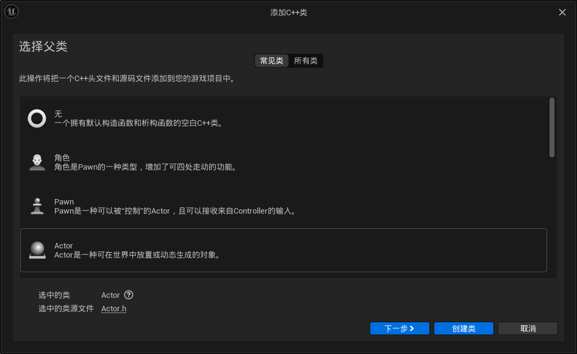
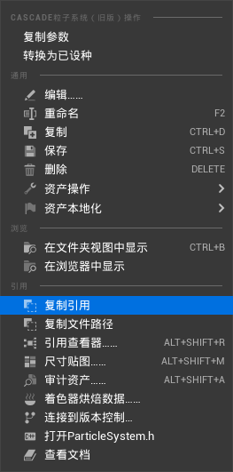
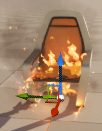

# CreateActor
## 创建actor

## include 组件
```cpp
#include "Components/SceneComponent.h"
#include "Components/StaticMeshComponent.h"
#include "Components/BoxComponent.h"
#include "Particles/ParticleSystemComponent.h"
#include "Components/AudioComponent.h"
```

## 添加组件
```cpp

	UPROPERTY(VisibleAnywhere, BlueprintReadOnly, Category = "MyComponent")
	class USceneComponent* MyScene;

	UPROPERTY(VisibleAnywhere, BlueprintReadOnly, Category = "MyComponent")
	class UStaticMeshComponent* MyMesh;

	UPROPERTY(VisibleAnywhere, BlueprintReadOnly, Category = "MyComponent")
	class UBoxComponent* MyBox;

	UPROPERTY(VisibleAnywhere, BlueprintReadOnly, Category = "MyComponent")
	class UParticleSystemComponent* MyParticle;
```

## 构造函数
```cpp
AMyActor::AMyActor()
{

	PrimaryActorTick.bCanEverTick = true;
	MyScene = CreateDefaultSubobject<USceneComponent>(TEXT("my Scene"));
	MyBox = CreateDefaultSubobject<UBoxComponent>(TEXT("my Box"));
	MyParticle = CreateDefaultSubobject<UParticleSystemComponent>(TEXT("my Particle"));
	MyMesh = CreateDefaultSubobject<UStaticMeshComponent>(TEXT("my Mesh"));

	RootComponent = MyScene;
	MyBox->SetupAttachment(RootComponent);
	MyParticle->SetupAttachment(RootComponent);
	MyMesh->SetupAttachment(RootComponent);

	//加载静态资源
	static ConstructorHelpers::FObjectFinder<UStaticMesh>	TempStaticMesh(TEXT("Your reference address"));

	MyMesh->SetStaticMesh(TempStaticMesh.Object);


	static ConstructorHelpers::FObjectFinder<UParticleSystem>	TempStaticParticle(TEXT("Your reference address"));

	MyParticle->SetTemplate(TempStaticParticle.Object);
}
```
右键资源：复制引用


## 其他函数中动态加载资源
```cpp
// 加载object
	UStaticMesh* TempMesh = LoadObject<UStaticMesh>(nullptr, TEXT("Location"));
	if (MyMesh != nullptr)
	{
		MyMesh->SetStaticMesh(TempMesh);
	}
	else {
		UE_LOG(LogTemp, Warning, TEXT("MyMesh null"));
	}
//加载类
	UClass* mTmpClass = LoadClass<AActor>(this, TEXT("your'reference_C'"));
	if (mTmpClass != nullptr)
	{
		AActor* SpawnActor = GetWorld()
			->SpawnActor<AActor>(mTmpClass,FVector{1.,2.,3.}, FRotator::ZeroRotator);
	}
```
