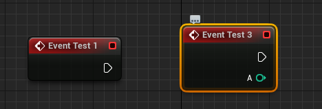

# 虚幻5 宏
宏的作用：让引擎可以识别到这些变量、函数和类，可以在蓝图上进行便捷的操作。

## UPROPERTY()
示例：
### UPROPERTY(Visible...)
```cpp
    // 无论是否处于类中的pulic或private，
    // 若设置了宏，则在蓝图中可见

    //这个变量仅在类默认设置可见
    UPROPERTY(VisibleDefaultsOnly)  int32 DefaultOnly = 1; 

    //这个变量仅在实例化细节可见
    UPROPERTY(VisibleInstanceOnly)  int64 InstanceOnly = 4;

    // 这个变量那里都可见
    UPROPERTY(VisibleAnywhere)      FVector AnywhereVector = {1,2,3};
```
### UPROPERTY(Edit...)
```cpp
    // 哪里都可以编辑
    UPROPERTY(EditAnywhere)     FVector EditAnywhereVector = {1,2,3};

    // 实例化可编辑
    UPROPERTY(EditInstanceOnly)  int32 EditInstanceOnly = 1; 
    // 类默认可编辑
    UPROPERTY(EditDefaultsOnly)  int32 EditDefaultOnly = 1; 

    // 蓝图中可读可写
    UPROPERTY(EditAnywhere, BlueprintReadWrite)  int32 var = 1; 

    // 在蓝图中可读
    UPROPERTY(EditAnywhere, BlueprintReadOnly)  int32 blueprintReadOnly = 1; 
```
### CateGory 
```cpp
    // Category 目录
    // "|"后面是子目录
    // 在蓝图中可以在目录下找到这个变量
    UPROPERTY(Category = "MyVar|SubVar")   int32 var = 1;
```
### mata 元数据说明符
#### DisplayName
```cpp
    //Display别名
    UPROPERTY(EditAnywhere, BlueprintReadWrite,
    meta = (Displayname = "var3Display"))  int32 var3 = 1; 
    // 在蓝图中将无法找到var3,但能找到var3Display。
```
#### EditCondition
```cpp
    UPROPERTY(EditAnywhere, BlueprintReadWrite,
    meta = (Displayname = "canContral"))  bool CanUse = true; 

    // 只有当变量"CanUse"为真时变量才可以编辑
    UPROPERTY(EditAnywhere, BlueprintReadWrite,
    meta = (EditCondition = "CanUse"))  int32 var3 = 1; 
```

#### ToolTip
```cpp
    UPROPERTY(EditAnywhere, BlueprintReadWrite,
    meta = (ToolTip = "VarisUsed"))  bool isUsed = true; 

```


## UFUNCTION
### BlueprintCallable
```cpp
    //使函数在蓝图中可调用
    UFUNCTION(BlueprintCallable,
    Category = "myFunc")
        void Func();
```
### BlueprintPure
```cpp
    // 这意味着函数再蓝图中已纯函数调用
    // 这样的函数可以在蓝图中的任何地方调用，
    // 而不会对蓝图的执行流程产生副作用，类似于
    void getX() const {}
    //                //

    UFUNCTION(BlueprintCallable,
    BlueprintPure, Category = "myFunc")
    bool printfs();
```

### BlueprintImplementableEvent
```cpp
// 注：没有加入BlueprintCallable，
// 因此不能再蓝图中调用,只能重载
// 调用这些函数又c++完成
// c++ 不能提供这些函数的实现
// 实现由蓝图提供

    // 无返回无参数
    UFUNCTION(BlueprintImplementableEvent)
        void test1();
    // 有返回值无参数
    UFUNCTION(BlueprintImplementableEvent)
        int test2();
    // 无返回值有参数
    UFUNCTION(BlueprintImplementableEvent)
        void test3(const int32 a);
    // 有返回值有参数
    UFUNCTION(BlueprintImplementableEvent)
        bool test4(const FString& str);    
```



### BlueprintNativeEvent
```cpp
    // 蓝图中可选择重载
    // 若重载，程序会调用蓝图重载的这个函数
    // 若没重载，程序调用_Implementation

    // in .h
    UCLASS()
    class MAINPROJECT_API AMyPawn : public APawn
    {
	    GENERATED_BODY()
        UFUNCTION(BlueprintNativeEvent)
            int TestA();
    }

    // in .cpp
    int AMyPawn::TestA_Implementation()
    {
	    return 0;
    }
    
    // 在cpp实现中要加上_Implementation
    // 否则无法通过编译
```

## ENUM
### BlueprintType
这意味着在蓝图中创建变量的话可以创建这个枚举变量
### 方法一
```cpp
    // 枚举 
    UENUM(BlueprintType)
    namespace MyEnumType{
        enum MyEnum{
            type1,
            type2,
            type3,
        };
    }

    // 创建变量
    UPROPERTY(EditAnywhere, BlueprintReadWrite, Category = "MyEnum")
        TEnumAsByte<MyEnumType::MyEnumType> MyEnum;

    

```
### 方法二
```cpp
    // out class
    UENUM(BlueprintType)
    enum class MyEnumType : uint8
    {
	    first UMETA(DisplayName = "type1"),
	    second UMETA(DisplayName = "type2"),
	    third UMETA(DisplayName = "type3"),
    };

    // in class
    UPROPERTY(EditAnywhere, BlueprintReadWrite, Category = "MyEnum")
    MyEnumType enum2;
```


## USTRUCT
```cpp
    USTRUCT(BlueprintType)
    struct FTestStruct {

	    GENERATED_USTRUCT_BODY()

	    UPROPERTY(EditAnywhere,BlueprintReadWrite)
	    FString name;

	    UPROPERTY(EditAnywhere, BlueprintReadWrite)
	    int32 health;

    };

    // 变量
    UPROPERTY(EditAnywhere, BlueprintReadWrite, Category = "MyStruct")
	FTestStruct ms;
```


## ExposeSpawnValue
```cpp
	UPROPERTY(EditAnywhere, BlueprintReadWrite, Category = "Expose...",
		meta = (ExposeOnSpawn = "ExposeOnSpawnValue"))
	float mHealth;
```

