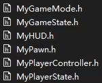
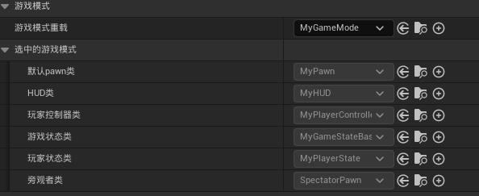

# BuildDefautClass
## 需要的默认类

## 需要的代码
### include
```cpp
 // include:
#include "CoreMinimal.h"
#include "GameFramework/GameMode.h"
#include "MyCharacter.h"
#include "MyHUD.h"
#include "MyPlayerController.h"
#include "MyPlayerState.h"
#include "MyPawn.h"
#include "MyGameState.h"
#include "MyGameMode.generated.h"
```
__注意： MyGameMode.generated.h 一定要在最下面__

### Gamemode构造函数
```cpp
// in .h
class MAINPROJECT_API AMyGameMode : public AGameMode
{
	GENERATED_BODY()
	AMyGameMode();
};

// in .cpp
AMyGameMode::AMyGameMode()
{
	DefaultPawnClass = AMyPawn::StaticClass();
	PlayerControllerClass = AMyPlayerController::StaticClass();
	GameStateClass = AMyGameState::StaticClass();
	PlayerStateClass = AMyPlayerState::StaticClass();
	HUDClass = AMyHUD::StaticClass();
}
``` 
## 选择游戏模式

