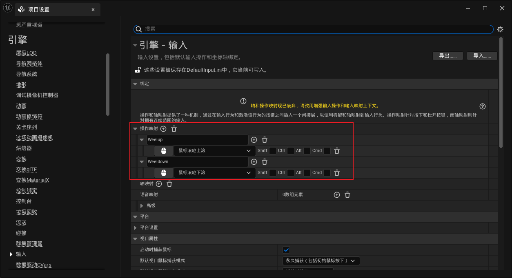

# Set Spawn
## 加入组件变量
```cpp
	UPROPERTY(VisibleAnywhere,BlueprintReadOnly,Category = "MySceneComponent")
	USceneComponent* MyRoot;

	UPROPERTY(VisibleAnywhere, BlueprintReadOnly, Category = "MySceneComponent")
	USpringArmComponent* MySpringArm;

	UPROPERTY(VisibleAnywhere, BlueprintReadOnly, Category = "MySceneComponent")
	UCameraComponent* MyCamera;
```

## 构造函数 添加子父组件
```cpp
AMyPawn::AMyPawn()
{
 	// Set this pawn to call Tick() every frame.  You can turn this off to improve performance if you don't need it.
	PrimaryActorTick.bCanEverTick = true;
	MyRoot = CreateDefaultSubobject<USceneComponent>(TEXT("mRootComponent"));
	MySpringArm = CreateDefaultSubobject<USpringArmComponent>(TEXT("mSpringArmComponent"));
	MyCamera = CreateDefaultSubobject<UCameraComponent>(TEXT("mCameraComponent"));
	RootComponent = MyRoot;
	MySpringArm->SetupAttachment(MyRoot);
	MyCamera->SetupAttachment(MySpringArm);
	MySpringArm->bDoCollisionTest = false;
}
```

## 设置摄像机位置
```cpp
	FVector mLocation = { 0,0,0 };
	FRotator mRotation = { -50,0,0 };
	FVector mScale = { 1,1,1 };
	SetActorLocation(mLocation);
	SetActorRotation(mRotation);
	SetActorScale3D(mScale);
```

## 实现滚轮滑动控制摄像头远近
### Pawn类中的zoom滑动函数
```cpp
void AMyPawn::Zoom(bool derection, float speed)
{
	//向上
	if (derection == true)
	{
		if (MySpringArm->TargetArmLength >= 300 )
		{
			MySpringArm->TargetArmLength -= (speed * 2);
			// log
		}
	} // 向下
	else {
		if (MySpringArm->TargetArmLength <= 1500)
		{
			MySpringArm->TargetArmLength += (speed * 2);
			// log
		}
	}
}
```

### 在项目中设置键位映射

* 添加InputComponent
```cpp
// in .h
	virtual void SetupInputComponent() override;

// in .cpp
void AMyPlayerController::SetupInputComponent()
{
    // 最后一个参数传入函数指针，TEXT对应之前设置的名字
	Super::SetupInputComponent();
	InputComponent->BindAction(TEXT("Weelup"), IE_Pressed, this, &AMyPlayerController::InputWeelupFunc);
	InputComponent->BindAction(TEXT("Weeldown"), IE_Pressed, this, &AMyPlayerController::InputWeeldownFunc);
}
```
* 实现对应函数逻辑
```cpp
// in .h
	void InputWeelupFunc();
	void InputWeeldownFunc();
// in .cpp
void AMyPlayerController::InputWeelupFunc()
{
	if (GetPawn() != nullptr)
	{
        // 对返回的APawn类型向下转型
		AMyPawn* MyCameraPawn = Cast<AMyPawn>(GetPawn());
		if (MyCameraPawn != nullptr)
		{
			MyCameraPawn->Zoom(true, 10);
		}
	} //else log error
}
```