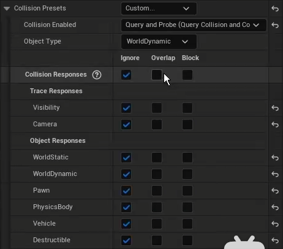

# 碰撞检测
## method
方法调用类似于重叠检测
```cpp
	MyBox->OnComponentHit.AddDynamic(this, &AMyActor::OnHitEvent);
```
```cpp
// in .h
UFUNCTION()
void OnHitEvent(UPrimitiveComponent* HitComponent, AActor* OtherActor, UPrimitiveComponent* OtherComp, FVector NormalImpulse, const FHitResult& Hit);

// in .cpp
// your logic

```

## 设置碰撞
## method
```cpp
	MyBox->SetCollisionEnabled(ECollisionEnabled::Type);
    // ECollisionEnabled::Type :
    /** Enum used to describe what type of collision is enabled on a body. */
UENUM(BlueprintType)
namespace ECollisionEnabled 
{ 
	enum Type : int
	{ 
		/** Will not create any representation in the physics engine. Cannot be used for spatial queries (raycasts, sweeps, overlaps) or simulation (rigid body, constraints). Best performance possible (especially for moving objects) */
		NoCollision UMETA(DisplayName="No Collision"), 
		/** Only used for spatial queries (raycasts, sweeps, and overlaps). Cannot be used for simulation (rigid body, constraints). Useful for character movement and things that do not need physical simulation. Performance gains by keeping data out of simulation tree. */
		QueryOnly UMETA(DisplayName="Query Only (No Physics Collision)"),
		/** Only used only for physics simulation (rigid body, constraints). Cannot be used for spatial queries (raycasts, sweeps, overlaps). Useful for jiggly bits on characters that do not need per bone detection. Performance gains by keeping data out of query tree */
		PhysicsOnly UMETA(DisplayName="Physics Only (No Query Collision)"),
		/** Can be used for both spatial queries (raycasts, sweeps, overlaps) and simulation (rigid body, constraints). */
		QueryAndPhysics UMETA(DisplayName="Collision Enabled (Query and Physics)"),
		/** Only used for probing the physics simulation (rigid body, constraints). Cannot be used for spatial queries (raycasts,
		sweeps, overlaps). Useful for when you want to detect potential physics interactions and pass contact data to hit callbacks
		or contact modification, but don't want to physically react to these contacts. */
		ProbeOnly UMETA(DisplayName="Probe Only (Contact Data, No Query or Physics Collision)"),
		/** Can be used for both spatial queries (raycasts, sweeps, overlaps) and probing the physics simulation (rigid body,
		constraints). Will not allow for actual physics interaction, but will generate contact data, trigger hit callbacks, and
		contacts will appear in contact modification. */
		QueryAndProbe UMETA(DisplayName="Query and Probe (Query Collision and Contact Data, No Physics Collision)")
	}; 
} 
```

## 碰撞类型设置
### method
```cpp
// 定义：
void UPrimitiveComponent::SetCollisionObjectType(ECollisionChannel Channel);
// 调用：
MyBox->SetCollisionObjectType(ECC_Pawn);

UENUM(BlueprintType)
enum ECollisionChannel : int
{
	ECC_WorldStatic UMETA(DisplayName="WorldStatic"),
	ECC_WorldDynamic UMETA(DisplayName="WorldDynamic"),
	ECC_Pawn UMETA(DisplayName="Pawn"),
	ECC_Visibility UMETA(DisplayName="Visibility" , TraceQuery="1"),
	ECC_Camera UMETA(DisplayName="Camera" , TraceQuery="1"),
	ECC_PhysicsBody UMETA(DisplayName="PhysicsBody"),
	ECC_Vehicle UMETA(DisplayName="Vehicle"),
	ECC_Destructible UMETA(DisplayName="Destructible"),
}
```

## 碰撞响应
### method
```cpp
    MyBox->SetCollisionResponseToAllChannels(ECollisionResponse NewResponse);
    MyBox->SetCollisionResponseToChannels(ECollisionChannel c,ECollisionResponse r);
UENUM(BlueprintType, meta=(ScriptName="CollisionResponseType"))
enum ECollisionResponse : int
{
	ECR_Ignore UMETA(DisplayName="Ignore"),
	ECR_Overlap UMETA(DisplayName="Overlap"),
	ECR_Block UMETA(DisplayName="Block"),
	ECR_MAX,
};
```

* 以上可在蓝图中设置：  

